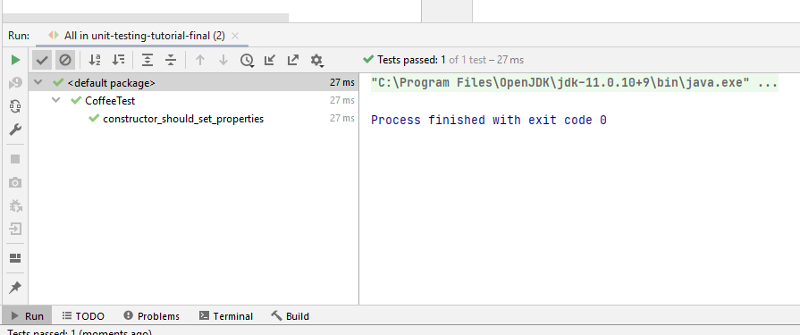
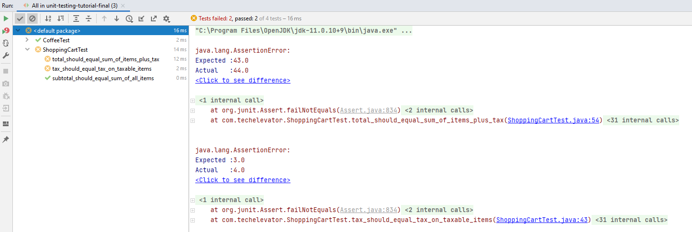

# Unit testing tutorial

In this tutorial, you'll create new units tests for an existing ("legacy") codebase. By the end of this tutorial, you'll understand:

- How to write unit tests in a legacy codebase.
- How unit testing can show that the code is functioning correctly.
- How to organize your unit tests.
- How to set up a test to _arrange_, _act_, and _assert_.
- How to debug unit tests.

## Getting started

To get started, follow these steps:

1. Open the project with IntelliJ IDEA.
2. Once the project is open, navigate to the project folder `src/main/java/com/techelevator`.

You'll see the code for a Bookstore project. This is the _system under test_. You'll write unit tests for the classes that make up this application.

## Step one: Inspect the existing codebase

Before you can write tests for any existing codebase, you need to be familiar with the code's purpose and what its requirements are. For some code, there may be documentation that lists all the requirements of a system. If that exists, that's a great place to start.

For this example, you only have the code and no other documentation. So spend a few minutes looking through the class files. 

Open `Bookstore.java` and run the program by clicking on the green arrow in front of the `main` method header. You'll see output like this in your terminal window:

```
Welcome to The Bookstore

Receipt

Book: 'A Tale of Two Cities' by Charles Dickens, Price: $14.99
Book: 'The Three Musketeers' by Alexandre Dumas, Price: $12.95
Book: 'Childhood's End' by Arthur C. Clark, Price: $5.99
Movie: 'Toy Story'(G), Price: $19.99
Movie: 'Airplane!'(PG), Price: $14.99
Coffee: Extra-large Dark Roast (Creme). Price: $3.99
Coffee: Medium House Blend (Soy milk,Sugar). Price: $2.79

Subtotal: $75.69
Tax: $5.68
Total: $81.37
```

In the code, you can see the following classes:

* `Bookstore`: the main program which creates a shopping cart, adds items to the cart, and prints a receipt.
* `ShoppingCart`: A container to hold all of the items to purchase at the store.
* `Purchasable`: Any item that you can place into a `ShoppingCart` must implement this interface.
* `MediaItem`: The base class for books, movies and other media items that the store can sell. Implements `Purchasable`.
* `Book`, `Movie`: Subclasses of `MediaItem` to represent specific type of media.
* `Coffee`: A purchasable item which isn't media. Implements `Purchasable`.

## Step two: Plan your tests and conditions

Once you understand the requirements of the program, you plan the classes and the methods within those classes that you'll test. After that, you need to think of all of the conditions you must test. Try to think of "normal" successful conditions, conditions that might cause errors, and edge cases. Write them all down before you start writing tests. You'll come back to this list as you complete the tests.

For this application, here are some tests you might create:

* `Book`, `Coffee`, and `Movie`:
  * These classes mostly consist of properties with little business logic in its methods, so there isn't a lot to test. You usually don't write tests for every getter and setter because they're often very simple, and they usually get tested while you're testing other parts of the application.
  * _Constructors_: However, each class has a non-default constructor, and in some cases that constructor calls the superclass constructor. It's a good idea to test these to make sure all the properties get set properly. Here are some conditions you could test:
    * Create a "normal" item with a title, price, and other properties, and make sure the values of those properties are correct on the object.
    * Create an item with a price of $0.00, and expect that to be the price of the item.
    * Create an item with a price that's less than $0.00. An item must never have a negative price, so expect its price to be $0.00.
    * For `Coffee`:
      * Create an item with an array of additions, and verify that the additions property has the proper value. It must have the right number of additions in it.
      * Create an item with an empty array of additions, and verify that the additions property is empty. It must be empty.
      * Create an item with a `null` array of additions, and verify that the additions property has the proper value. It must be empty.
* `ShoppingCart`: 
  * _Constructor_: There is one default constructor which accepts a tax rate (applied to all taxable items). You could test these conditions:
    * Create a cart using a positive tax rate and verify the rate is set correctly.
    * Create a cart with a zero tax rate and verify the rate is zero. Jurisdictions without sales taxes are possible.
    * Create a cart with a negative tax rate. There are no negative tax jurisdictions, so expect the rate to be zero.
  * `getSubtotalPrice()`: This method calculates the total price of all the items in the cart. Here are some conditions you could test:
    * Add a few items to the cart and make sure this method returns the total of all the items' prices.
    * Call this method on a brand new, empty cart and expect a return value of $0.00.
  * `getTax()`: This method returns the total tax due. Tax due is calculated by applying the shopping cart tax rate to each of the _taxable_ items in the cart. You might check these conditions:
    * Add a few taxable items and a few non-taxable items to the cart and make sure the tax is calculated properly by taxing only the appropriate items.
    * Add only non-taxable items to the cart and verify the method returns $0.00.
    * Call the method against an empty cart and verify the result is $0.00.
  * `getTotalPrice()`: This method returns the total of item prices plus the total tax applied. You could test these conditions:
    * Add a mix of items to the cart and verify the total is correct.
    * Call this method on an empty cart and verify it returns $0.00.

Since interfaces, such as `Purchasable`, don't contain code (implementation), you don't test interfaces. Instead, you test the classes which implement the interface. Similarly, you'd test abstract classes like `MediaItem` through their derived concrete classes.

You can see that when you start thinking about error conditions and edge cases, the number of tests can get very large. You can probably think of even more conditions, but this is a good start. You can now start writing tests.

## Step three: Create the `CoffeeTest` class and your first test method

In this tutorial, you won't create all the tests listed in step two. You'll create just a few to get practice. Start by writing tests for the `Coffee` class. 

### Add the test class

The first thing you need to do is create the _test class_. This is a standard Java class whose methods contain test code.

In the IntelliJ project window, navigate to `src/test/java/com/techelevator`. Right-click on the folder and select **New > Java Class**. Enter `CoffeeTest` as the class name and press **Enter**.

### Add a test method

Looking at the list of tests, the first one is to test calling the constructor with normal, valid parameters. This testing of normal, expected behavior is sometimes called "happy path testing."

Create a method to test the constructor. All tests are `public`, have a `void` return type, and declare no arguments. In addition, you mark the method with the `@Test` annotation. The name of the method clearly indicates what's being tested:

```java
@Test
public void constructor_should_set_properties() {
```

> Note: If IntelliJ reports an error that says the `@Test` isn't recognized, you may need to add `import org.junit.Test;` near the top of the file, just after the `package` directive.

The body of a test method contains the three A's: _Arrange_, _Act_, and _Assert_. It's a good idea to add a comment for each of these, which forces you to think about what you need to code:

```java
@Test
public void constructor_should_set_properties() {
    // Arrange - since we are testing a constructor, there's nothing to set up

    // Act - call the constructor by creating a new object, passing valid parameters

    // Assert - verify the properties are set appropriately
}
```

Now complete the test logic. Since the test is creating a new `Coffee` object and verifying its properties, there is no logic needed under _Arrange_. In more complex tests, you might create multiple objects or arrays of data as part of the setup.

Under _Act_, add code to create a new `Coffee` instance:

```java
// Act - call the constructor by creating a new object with valid parameters
Coffee coffee = 
    new Coffee("Large", "Decaf", new String[]{"cream", "sugar"}, 2.99);
```

The _Assert_ step is where you write code to make the test pass or fail. Under _Assert_, you verify all the things that must be true for the test to pass. These are _assertions_:

```java
// Assert - verify the properties are set appropriately
Assert.assertEquals("Large", coffee.getSize());
Assert.assertEquals("Decaf", coffee.getBlend());
Assert.assertEquals(2.99, coffee.getPrice(), 0.00);
Assert.assertEquals(2, coffee.getAdditions().length);
```

`Assert` is a class which contains static methods that compare values to determine if the assertion is true. If any of the assertions isn't true, the test fails.

> Note: if IntelliJ reports an error that says the `Assert` isn't recognized, you may need to add `import org.junit.Assert;` to the import directives near the top of the file.

The most common method in the `Assert` class is `assertEquals`, which compares values, but there are other methods you can use when creating tests. You can find more on the [documentation page for `Assert`](https://junit.org/junit4/javadoc/latest/org/junit/Assert.html).

## Step four: Run the tests

You've written your first test. To run it, in the project window, right-click on the project name (**tutorial [unit-testing-tutorial]**), and select **Run 'All Tests'** from the menu. You'll see test results in the **Run** window in a moment.



You can add more methods to `CoffeeTest` to implement the tests you planned in step two after you complete this tutorial. For now, move on to create tests for `ShoppingCart`.

## Step five: Create the `ShoppingCartTest` class and test methods

To create a new class, right-click on the folder `src/test/java/com/techelevator`, select **New > Java Class**, enter `ShoppingCartTest` as the class name, and press **Enter**.

### Test the subtotal

Create a "happy path" test that adds items to a shopping cart, then verifies the shopping cart subtotal is accurately calculated. Add this method to the `ShoppingCartTest` class:

```java
@Test
public void subtotal_should_equal_sum_of_all_items() {
    // Arrange - Create a shopping cart with items

    // Create a shopping cart and add both taxable and non-taxable items to it.
    ShoppingCart cart = new ShoppingCart(0.10);     // 10% tax rate
    // Taxable $10 plus $1 tax
    cart.add( new Book("Dynamics of Software Development", "Jim McCarthy", 10.00));
    // Taxable $20 plus $2 tax
    cart.add( new Movie("Free Guy", "PG-13", 115, 20.00));
    // Not taxable $10
    cart.add( new Coffee("Jumbo", "Bold", new String[]{"cream"}, 10.00));

    // Act - get the subtotal
    double subtotal = cart.getSubtotalPrice();

    // Assert - Make sure value is correct
    Assert.assertEquals(40.00, subtotal, 0.00);
}
```

For shopping cart tests, you need to do more in the _arrange_ part of the test. You create a shopping cart, and fill it with some sample items. Only after that can you verify the subtotal.

Run the test and ensure it passes.

### Refactor the subtotal test

Next, you want to create some "happy path" tests to verify tax calculation and total price calculation. These methods also must create a shopping cart and add some items to it. 

You can copy the _arrange_ code from `subtotal_should_equal_sum_of_all_items()` to create a similar cart, but that defies the **D**on't **R**epeat **Y**ourself principle. A better idea is to factor the _arrange_ code into a separate method. 

Replace the `subtotal_should_equal_sum_of_all_items()` method with this code:

```java
private ShoppingCart createAndFillCart() {
    // Create a shopping cart and add both taxable and non-taxable items to it.
    ShoppingCart cart = new ShoppingCart(0.10);     // 10% tax rate

    // Taxable $10 plus $1 tax
    cart.add( new Book("Dynamics of Software Development", "Jim McCarthy", 10.00));
    // Taxable $20 plus $2 tax
    cart.add( new Movie("Free Guy", "PG-13", 115, 20.00));
    // Not taxable $10
    cart.add( new Coffee("Jumbo", "Bold", new String[]{"cream"}, 10.00));
    return cart;
}

@Test
public void subtotal_should_equal_sum_of_all_items() {
    // Arrange - Create a shopping cart with items
    ShoppingCart cart = createAndFillCart();

    // Act - get the subtotal
    double subtotal = cart.getSubtotalPrice();

    // Assert - Make sure value is correct
    Assert.assertEquals(40.00, subtotal, 0.00);
}
```

After factoring the setup code into this helper method, any additional test can call `createAndFillCart()` if it requires a similar cart.

Run the test again to make sure your refactoring didn't affect the result.

### Automatic setup using `@Before`

If you find that most or all of your tests need this same setup code, there is one more step you can take to make this automatic. You indicate code that must run _before every test_ using the `@Before` annotation. Once this is in place, you can remove the explicit call to `createAndFillCart()`. The test framework automatically calls it for you, before every test.

Replace the previous code with this:

```java
private ShoppingCart cart;

@Before
public void createAndFillCart() {
    // Create a shopping cart and add both taxable and non-taxable items to it.
    this.cart = new ShoppingCart(0.10);     // 10% tax rate

    // Taxable $10 plus $1 tax
    cart.add( new Book("Dynamics of Software Development", "Jim McCarthy", 10.00));
    // Taxable $20 plus $2 tax
    cart.add( new Movie("Free Guy", "PG-13", 115, 20.00));
    // Not taxable $10
    cart.add( new Coffee("Jumbo", "Bold", new String[]{"cream"}, 10.00));
}

@Test
public void subtotal_should_equal_sum_of_all_items() {
    // Arrange - the @Before method creates a cart before every test

    // Act - get the subtotal
    double subtotal = cart.getSubtotalPrice();

    // Assert - Make sure value is correct
    Assert.assertEquals(40.00, subtotal, 0.00);
}
```

Notice a few things about this new code:

* You must mark `createAndFillCart()` as `public` so the testing framework can run it.
* Instead of returning a `ShoppingCart`, the method stores a reference to the shopping cart into a private member variable. The method now returns `void`.
* The test doesn't explicitly call the setup method. The framework calls it before calling each test.
* The test uses the private member variable `cart`.

Run the test once more to see it work.

### Add tests for tax and total

Now you can add tests to verify the tax and total price of items in the cart:

```java
@Test
public void tax_should_equal_tax_on_taxable_items() {
    // Arrange - the @Before method creates a cart before every test

    // Act - get the tax
    double tax = cart.getTax();

    // Assert - Make sure value is correct
    Assert.assertEquals(3.00, tax, 0.00);
}

@Test
public void total_should_equal_sum_of_items_plus_tax() {
    // Arrange - the @Before method creates a cart before every test

    // Act - get the total
    double total = cart.getTotalPrice();

    // Assert - Make sure value is correct
    Assert.assertEquals(43.00, total, 0.00);
}
```

You've now created three "happy path" tests: one each to test `getSubtotalPrice()`, `getTax()`, and `getTotalPrice()`. Run the tests. Two of the three tests in `ShoppingCartTest` fail:



Since you named the tests well, you can immediately see which scenarios are failing. In the right panel, you see detail about the exact code that failed and the expected and actual values.

By looking at the output, you can determine that the test for total price failed, expecting a value of 43.0, but receiving a value of 44.0. You can also see that the test for tax failed, expecting a value of 3.0 but receiving a value of 4.0. Since the total price includes the tax, and the tax is wrong, it makes sense to start your investigation in the tax test.

## Step six: Debug the tax test

To debug the test method `tax_should_equal_tax_on_taxable_items()`, add a breakpoint at its call to `cart.getTax()` by clicking in the gray column to the left of the code. A red dot appears indicating the breakpoint:


Now run the test in debug mode. In the code window, right-click anywhere inside the body of the test method, and select **Debug 'tax_should_equal_t...()'** to start the debugger.


The debugger starts and the test runs up to your breakpoint. Now you can use your debugging tools and skills to determine the problem. Step into the `cart.getTax()` call by pressing **F7**. The debugger stops inside the `getTax()` method:


Can you see what's wrong? The comment indicates that tax applies only to taxable items. You'd expect to see a condition checking whether the item is taxable before taxing it. 

Stop the debugger by clicking on the red square in the debugger toolbar or pressing **Control+F2**. Then change the `ShoppingCart.getTax()` method by adding in a check for taxability:

```java
for (Purchasable item : itemsToBuy) {
    if (item.isTaxable()){
        tax += item.getPrice() * this.taxRate;
    }
}
```

If you rerun the tests, all tests pass. By correcting the `getTax()` method, you changed both the tax test and the total price test from failing to passing.

## Next steps

In this tutorial, you learned how to create test classes and test methods, run those tests, and debug failing tests. 

If you want more practice, you can review the test plan you created in step two, and implement as many of those tests as you'd like.

If you decide to implement these tests, you'll find that several of them uncover bugs in the application, especially around passing negative or null values into constructors. How will you modify the application to "harden" it against bad data?

