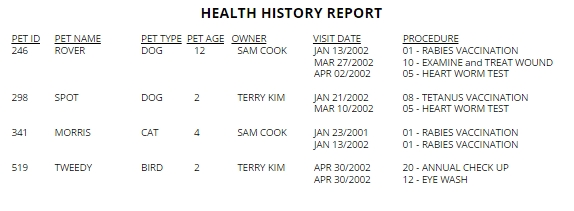
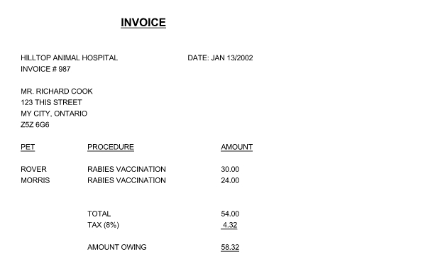

# Normalization Exercises

## Animal Hospital Health History Report

You are helping an animal hospital migrate to a new database platform, and part of the work involves 
designing the new database that stores animal health data.

The hospital has provided an example health history report that they want to generate
and you need to design your data model to support this.

Work with your partner to create an ER diagram and ensure that the design supports 1NF, 2NF, and 3NF when possible.
The submission that you provide should include the SQL scripts necessary to create the database 
and any additional constraints, such as primary keys and foreign keys.

Feel free to make some assumptions about the data model, but make sure that they are documented at the top
of the script if they influence your design decision.

## Animal Hospital Health Invoice

You are now designing the data needed for issuing animal hospital invoices.

Work with your partner to create an ER diagram for this exercise, ensuring that it adheres to 1NF, 2NF, and 3NF when possible.
The submission that you provide should be in a separate SQL file and include the script necessary to create the database tables
and any additional constraints, such as primary keys and foreign keys.