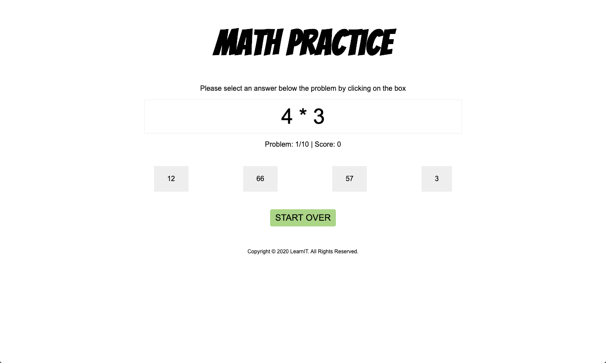

# Week 10 Review Pair Exercise

## Context

You just landed a role as a junior developer for a new eLearning startup called LearnIT.

Your first project is to build an application that helps students practice mathematical problem sets. The initial version of this application focuses on multiplication practice.

Before you start, be sure to review the provided HTML and CSS and look at the mockups.

## Application overview

When the application loads, the student is given a problem set with ten multiplication problems. They'll see the problem they need to solve, how many problems they've completed, their score, and four possible answers. At any time during the problem set, the student can start over by clicking "Start Over."



Once the student finishes all ten questions, they'll see a summary screen. This screen removes the intro text, problem, and answers.


## Application requirements

- The problem set must contain ten problems but should be flexible enough to change in the future.
- The problems must be randomly generated.
  - The left and right operands must be between 0 and 9.
  - The operation must be multiplication.
- When a student is presented with a problem, show four possible answers: one correct answer and three randomly generated answers.
  - Allow them to click on the `<li>` to answer the problem.
  - Consider this: if the left and right operands are between 0 and 9, what is the max possible answer?
- When a student answers a question, the application must:
  - Move to the next problem.
  - Update the current problem number.
  - Update the score, if needed.
- When a student answers the last question, hide any elements with the class `show-hide` to present the summary screen.
- When a student clicks "Start Over", the application must:
  - Generate a new problem set.
  - Reset the current problem.
  - Reset the score.

### Utility functions

There are two functions you'll need to use in this application that weren't covered this week. The first is `Math.random()`, which you can use to generate a random number. The second is `Array.sort()`, which sorts the elements of an array.

### `Math.random()`

[`Math`](https://developer.mozilla.org/en-US/docs/Web/JavaScript/Reference/Global_Objects/Math)
is a built-in object that has properties and methods for mathematical constants and functions. The `random()` function returns a random floating point between 0 and 1. What you want is a number between 0 and
some other number.

You can use a combination of `Math.floor()` which returns the largest integer less than or
equal to a given number and `Math.random()` to accomplish this:

```js
/**
 * Utility function to generate a random number based on max
 * @param {number} max
 */
function getRandomNumber(max) {
  return Math.floor(Math.random() * Math.floor(max));
}
```

The `max` isn't inclusive, so if you need to get a number between 0 and 9, you can call the function by passing the upper
bounds:

```js
getRandomNumber(10);
```

#### Shuffle array

If you create an array with four possible answers, you might want to shuffle the results so the correct answer
isn't always in the same position. In that case, you can use the `Array.sort()` method.

This method takes
a function to compare elements. You can use the `Math.random()` function to compare a
number between 0.5 and -0.5
:

```js
/**
 * Utility function to shuffle the items in an array
 * @param {object} arr
 */
function shuffleArray(arr) {
  return arr.sort(function (a, b) { return Math.random() - 0.5 })
}
```

If you have an array of answers in your application, you could sort them:

```js
const problem = 9 * 9;
const answers = shuffleArray([81,1,77,45]);
```

## Notes

- The application should start when the DOM loads.

## Optional challenge

If you finish early or want a challenge, this is for you.

LearnIT wants to release a new version of the application that allows students to practice addition, subtraction, multiplication, or division. This means that you'd need to update the application to show a new screen that asks students to pick the math operations they want to work on.


Each problem set must still consist of ten problems, but now, they'd include one or more operations based on the student's selection.

You probably hard-coded the operand `*` into the initial version of the application. How would you update it to allow students to choose multiple math operations?

