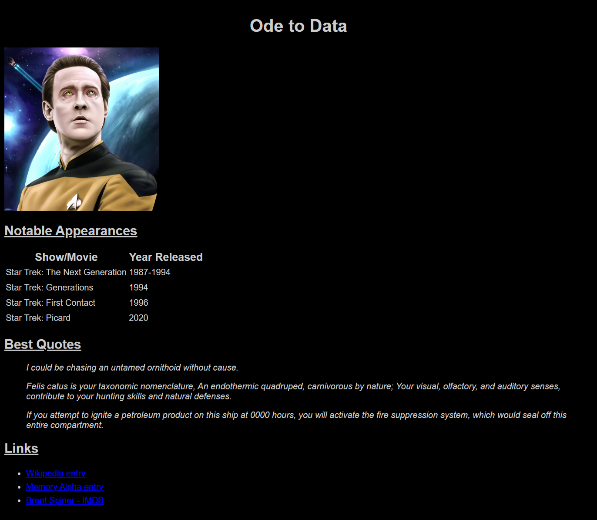
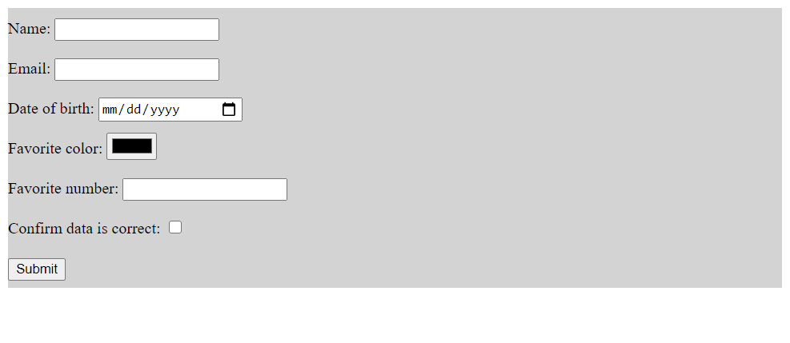

# Introduction to HTML and CSS exercise

In this two-part exercise, you'll create two HTML pages (and related CSS pages):

1. A fan page for something that you like. The fan page can be for your favorite movie or TV show, your favorite sports team, or your favorite band.
2. An HTML form to submit some information about yourself.

Some other ideas for fan pages might include:

* Your favorite book or book series
* Your favorite character from a book, movie, or TV show
* Your favorite actor
* Your favorite comic book character
* Your favorite video game or video game series
* Your favorite coding bootcamp program

For your fan page, you must display a title, picture, and some different information. For your information form, you must use the appropriate form elements for the data listed in the requirements section.

## Learning objectives

After completing this exercise, you'll understand:

* How to create HTML content using semantic HTML elements.
* How to create HTML forms to accept user input.
* How to use CSS to apply styling to elements on an HTML page.

## Evaluation criteria and functional requirements

* Your page displays using Live Server within Visual Studio Code.
* All tests pass as expected.

## Getting started

1. Read the requirements for parts one and two.
2. Open the `exercise` folder in VS Code.
3. If this is the first time you have viewed this exercise, in a VS Code terminal window, type:

    ```bash
    npm install
    ```

    This prepares the testing software (Cypress) to run, and it may take a few minutes to complete.
4. Right-click on `index.html` and select **Open with Live Server** to view your page. Do the same with `info.html` when you're working on part two.
5. Write HTML and CSS as needed to satisfy the requirements.
6. Run the tests at any time using one of the following commands in a terminal window:
    * `npm run test` - Opens the Cypress UI, which allows you to run tests and view results interactively.
    * `npm run test-headless` - Doesn't open the Cypress UI, but runs the tests and displays results in the terminal window. This is a quicker way to run tests.
7. Repeat until all tests pass.

 ## Part 1: Fan page requirements

 ### General requirements
 
* In the `exercise` folder, open `index.html` to create your fan page.
* Create a CSS file, either in the same folder or in a `css` subfolder, and link to it from your `index.html` page.
* Use semantic HTML to organize content. 
* When you must add formatting to your page, include the appropriate CSS rules in the linked CSS file. Don't use HTML elements for formatting.
 
 ### Document structure

* Your document must have a meaningful title that appears as the browser tab's text.
* Your document must link to a separate `.css` file which contains style rules.
* Your document must have a background color that's different than the default background of white.
  * You may need to change the text color so it stands out from the new background.
* Your document must have a header area in which you display the main page heading.
* Your document must have a main area which displays your page content.

### Main page heading

* Your page must have a heading describing its purpose, using the appropriate tag for a page-level heading.
* The page heading must appear inside the appropriate semantic element.
* The heading text must be centered on the page.

### Image

* Your page must contain an image relevant to the subject, like a book cover, a movie poster, picture of a band, or picture of a team.
* All image tags in the main part of your page must refer to valid image files.
* All images in the main part of your page must be no wider than 400 pixels on the page. 
  * If your image is larger, use CSS to resize the image.

### Table section

* Your page must have a section with `id` of `facts-section`.
* Inside `facts-section`, your page must have a second-level heading describing its contents. The heading must be a direct child of the section.
* The heading inside the section must be underlined.
* `facts-section` must contain an HTML `table` element to include some information in a table.
  * Think of content that would benefit from a two or more column layout. Examples include:
    * Characters from movie or TV show and the actors that play them.
    * Book or movie titles in a series and the year released.
    * Band members and the instruments they play.
* The table must have multiple columns.


### Quotes section

* Your page must have a section with `id` of `quotes-section`.
* Inside `quotes-section`, your page must have a second-level heading describing its contents. The heading must be a direct child of the section.
* The heading inside the section must be underlined.
* `quotes-section` must include two or three quotes using the appropriate semantic element. 
  * Examples include your favorite song lyrics or your favorite TV character's quotes.
* You must use CSS—not HTML—to italicize the quote elements.

### Links section

* Your page must have a section with `id` of `links-section`.
* Inside `links-section`, your page must have a second-level heading describing its contents. The heading must be a direct child of the section.
* The heading inside the section must be underlined.
* `links-section` must include an unordered list of 2-4 links to other sites for the user to get more information. 
  * Examples include IMDb pages, Wikipedia pages, or official band or team sites.
* Each item in the unordered list must include a link. Use the appropriate HTML element to create a hyperlink.

## Part 2: Information form requirements

### General requirements

* In the `exercise` folder, open `info.html` to create your information form page.
* Create a CSS file, either in the same folder or in a `css` subfolder, and link to it from your `info.html` page.
* Use semantic HTML to organize content.
* When you must add formatting to your page, include the appropriate CSS rules in the linked CSS file. Don't use HTML elements for formatting.

### Document structure

* Your document must have a meaningful title that appears as the browser tab's text.
* Your document must link to a separate `.css` file which contains style rules.

### Form

* Your page must have a form element which contains all the controls for the user to enter data.
* The form must have the necessary attributes.
  * Consider the information being sent and what the appropriate method might be.
  * You may use a fake URL for the destination of the form submission.
* The form must have a background color that's different than the default background of white.

### Controls

The form must contain the following controls:  

|Label |Control `id` / `name` |Required |Description |
|---|---|---|---|
|Name | `name` | Yes | User's name |
|Email | `email` | Yes | User's email address |
|Date of birth | `date-of-birth` | | User's full  date of birth |
|Favorite color | `favorite-color` | | User's favorite color |
|Lucky number | `lucky-number` | | User's lucky number |
|Confirmation | `confirmation` | | Checkbox for the user to check to confirm the data is correct |

  * Each control must have its `name` and `id` set to the value in the preceding table.
  * Each control must have a label associated with it.
  * There must be one additional control for the user to press and submit the form.

## Example fan page

Your fan page doesn't have to look exactly like this example, but hopefully it gives you some direction.



## Example information form

You may choose different text and colors as long as you satisfy the requirements.



