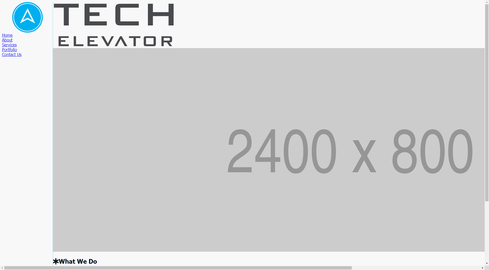
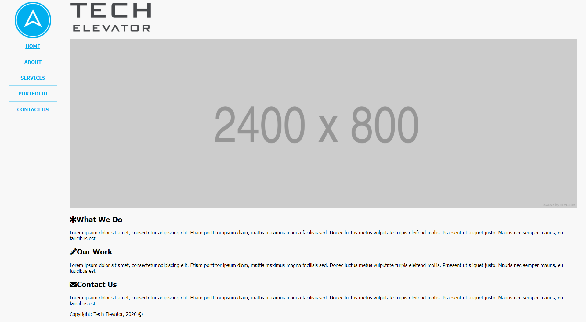

# CSS Selectors exercise

In this exercise, you'll take the existing HTML in `index.html`, and use CSS to create a layout that reproduces what's shown in the following image. You'll create the CSS for the page in `style.css`. You must not modify any of the existing HTML to complete this exercise.

## Learning objectives

After completing this exercise, you'll understand:

* How normal flow effects the layout of HTML elements.
* How to utilize different selectors to apply CSS styles.
* How to use CSS positioning.

## Evaluation criteria and functional requirements

* Your page displays using Live Server within Visual Studio Code.
* Your page looks similar to the expected result. Pixel perfection isn't required.
* All tests pass as expected.

## Getting started

1. Open the folder where this README is in VS Code.
2. If this is the first time you have viewed this exercise, in a VS Code terminal window, type `npm install`. This prepares Cypress, the testing software, to run. It may take a few minutes to complete.
3. Right-click `index.html` and select **Open with Live Server** to view your page.
4. Write CSS to style elements on the page to create the look described in each step.
5. Run the tests at any time by running the `npm run test` command in a terminal window.
6. Repeat until all tests pass.

## Before you begin

Take a moment to explore the HTML file and its structure. Take note of the `<aside>`, `<nav>`, `<main>`, `<header>`, `<section>`, and `<footer>` blocks, and how the element tags relate to the content in them. Notice how without any styling, all the blocks "flow" from top to bottom in the same order in the rendered HTML.

Look at the existing CSS in `style.css` that's set up for you. Take note of the `*`, `html`, and `body` selectors and how the styles set a "default" value for properties like font size and background color.

## Design considerations

The instructions in this exercise ask you to create borders and set colors. Keep these design considerations in mind and refer back to them when needed:

* All borders are 1 pixel wide.
* Blue: `#00ADEE`
* Blue Border: `rgba(0, 173, 238, 0.4)`
* Green: `#8CC36F`
* Green Border: `rgba(170, 239, 135, 0.8)`

## Step One: Style the `aside` element

In semantic HTML, element tags like `<aside>` and `<nav>` define the content that's contained in the tags. `<aside>` elements are typically used for sidebars, and `<nav>` elements are for navigation. Since the `<aside>` comes first in the HTML, you'll style this first.

The `<aside>` needs the following:

* Position that keeps it in the same place on the screen while the page scrolls.
* A blue border separating it from the rest of the page. See design consideration for color code.
* A height so that blue border extends to the bottom of the viewport.
* Give it a width of `200px`.

The `` in the `<aside>` needs some CSS rules too. Be specific with your selector so it doesn't affect the other images on the page.

The `img` needs the following:

* Give it a height or width of `120px` to resize it.
* Center the image using `margin`.

Finally, you need to move the `main` element over so it doesn't overlap with the `aside`:

* The `main` element needs at least `200px` on the left to clear the `aside`.
* There are several ways to accomplish this. Consider the box model when you decide on your solution. You may decide to change the property or the value later when you come back to styling the `main` element, but any way is fine at this step.

After this step, all tests under "Step One" pass and your page looks something like this:

## Step Two: Style the `nav` element

In semantic HTML, the `<nav>` contains elements—typically `<a>` elements—that provide navigation through the site. The `<a>` elements may be inside other elements that provide order or structure—in this case, they're inside `<li>` elements of a `<ul>` element. You'll style the `<li>` and `<a>` elements in this step.

For the `<li>` elements, create CSS that does the following:

* Center aligns text.
* Makes all the letters uppercase.
* Has a blue border separating each element. See design consideration for color code.
    * Review the screenshot of the expected product to figure out which border to use.

For the `<a>` elements inside the `<li>`s, add CSS that does the following:

* Makes the text bold.
* Sets text color to blue. See design consideration for color code.
* Removes the underline except for the first one.
    * *Hint: you'll need a separate CSS rule to select just the first one.*

Now the `<nav>` is starting to look like the screenshot, but there's still some work to do.

Notice in the screenshot that the lines don't go across the entire sidebar. You can set the width of the `<li>` elements to achieve that effect. *Tip: Don't set the width by pixels. Think of how you can always make sure the width is less than the width of the container.*

Once you shrink the width of the `<li>` elements, they no longer look centered on the sidebar. You can center them with `margin`.

Now you can see that the `<li>` elements have bullet points that were previously hidden off-screen but are now visible. Remove the bullet points with the `list-style` property.

Finally, add some more space between the lines and the text. See if you can come close to the screenshot. Think about the box model and where each property adds space.

After this step, all tests under "Step Two" pass and your page something looks like this:

## Step Three: Style the `main` element 

In semantic HTML, the `<main>` element contains the main content of a webpage. The `<header>` element might contain introductory content or navigation for that page. In this webpage, the `<header>` displays the logo. The `<main>` element also contains a 2400x800 banner image that you'll style in this step.

The header logo is a bit large. Change its height to `100px`, and add some spacing below it so it's not so close to the banner image. Be specific with the selector for the image so it only affects the header image.

Next, the 2400x800 banner image needs some styling so it doesn't go over the edge of the page. Give it a width value to use the rest of the viewport, but not more. Be specific with the selector so it only affects this image.

The `<main>` element is against the border of the `<aside>`. Go back to the rule that you created for the `<main>` element in step one. It must have `20px` clearance on both the left and right. Consider the box model when you decide on your solution.

After this step, all tests under "Step Three" pass and your page looks something like this:

## Step Four: Style `section`

The "What We Do", "Our Work", and "Contact Us" sections are still stacked on top of each other, but they need to be side by side.

Create a CSS rule to select the `
` elements in the `<section>` element and make their widths 33%. They'll still be on their own lines after you change the width, so you'll need to change another CSS property to get them to display on the same line.

> Hint: review the box model and the different layout behaviors.

Create another CSS rule that selects the headings in each `<section>` and make the text color green. See design consideration for color code.

The `<i>` element in each `<h2>` is a little too close to the text. Add a CSS rule that selects the `<i>` elements and some space between them and the text.

Write a CSS rule that adds a border between the sections. You'll have to write a selector that selects two out of the three `
` elements.

Finally, the `
` elements need some spacing around them so the text doesn't run up against the borders. Also look at how close the borders are to the banner image—add some spacing between them and the banner image too. Keep in mind your selectors and where you want the spacing to appear.

Now, all tests pass and your page now looks like the screenshot from the beginning of the exercise:

