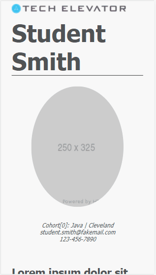

# CSS Grid exercise

In this exercise, you'll use CSS Grid and responsive web design to create three different layouts for a sample resume page. The three required layouts are a desktop layout, a tablet layout, and a phone layout.

## Learning objectives

After completing this exercise, you'll understand:

* How to use CSS Grid to create a page layout.
* How to nest one CSS Grid inside another for refined layout options.
* How to use CSS media queries to create pages that adjust their layout based on the device on which they're displayed.

## Evaluation criteria and functional requirements

* Your page displays using Live Server within Visual Studio Code.
* Your page shows different layouts for the screen widths defined in the requirements.
* All tests pass as expected.

## Getting started

1. Open the `exercise` folder in VS Code.
2. If this is the first time you have viewed this exercise, in a VS Code terminal window, type `npm install`. This prepares Cypress, the testing software, to run. It may take a few minutes to complete.
3. Right-click `index.html` and select **Open with Live Server** to view your page.
4. Run the tests at any time by running the `npm run test` command in a terminal window.
5. Follow the steps for each part of the exercise in the instructions that follow. After each part, be sure to run the tests to see your progress. You can rerun tests at any time.
6. Repeat until all tests are passing.

## Requirements

In this exercise, you'll use the existing HTML in `index.html`, and write CSS in `style.css` to create three different grid layouts that reproduce the following example images.

> **Note**: All of your work for this exercise must be in `style.css`. You must not modify the contents of `index.html` to complete this exercise.

The three required layouts are a desktop layout (greater than 1024px), a tablet layout (less than or equal to 1024px), and a phone layout (less than or equal to 450px):

**Desktop layout**

**Tablet layout**

**Phone layout**

You'll use CSS media queries to create these three layouts in a responsive manner.

## Before you begin

Take a moment to explore the HTML file and its structure. Take note of the `<main>`, `<h1>`, and `
` blocks, and how the content in each block displays in the different layouts.

Also, look at the existing CSS in `style.css` already set up for you. Colors and other styling have already been applied for you. You're only responsible for setting up the CSS grids in this exercise.

## Step one: Create grids and grid areas

Before starting on any of the layouts, you must define the grid areas in the CSS.

You'll define two HTML elements as grid containers. You can select these two elements by their `id` attributes: `main-grid` and `experience-grid`. Note how `experience-grid` is a child element of `main-grid`. The following two diagrams illustrate the grids you need to create:

**Action:** In `style.css`, create selectors for the two elements and add the CSS declarations to make them into Grid containers.

**Action:** The direct descendent elements of the container are the _grid items_. Look at the HTML and identify the _grid items_ that make up each grid. In your CSS file, create a selector for each _grid item_ and create a reasonable `grid-area` name for each. You _don't_ need to use the same grid-area names as the preceding screenshots.

*After you complete these steps, the tests under the "Step one: Create grids and grid areas" section pass.*

## Step two: Create the desktop layout

Now that you have defined the grid areas, you can create and style the grids. The first layout you'll create is the desktop layout.

Look at the Desktop layout diagram of the earlier in this document. To create that layout, `main-grid` must have three equally sized columns and four rows.

* `main-grid`:

  * **Action**: Use the appropriate CSS declaration to give `main-grid` three columns of equal width.
  * **Action**: Use a CSS declaration to give `main-grid` a row gap of 20px and a column gap of 50px.
  * **Action**: Define the `grid-template-areas` for `main-grid` to contain four rows of three columns each. Using the `grid-area` names you defined in the first step, assign each child element to its place in the grid. Refer to the Desktop layout diagram for guidance on how to place the elements in `grid-template-areas`. Note how `student-picture` is on the same rows as the `headline` and `student-quote`, and how `student-contact` is on the same row as `student-profile`. Also notice that the `experience-grid` element is a child of `main-grid`, and it occupies the entire fourth row of `main-grid`.
  * If you load your page in the browser, you might notice that some of the grid items don't look positioned exactly like the "Desktop layout" image. You need to align items vertically within their grid cells so they have equal space above and below the text. Also, you need to center the student picture and contact information horizontally within their grid cells.
  * **Action**: In the selector for `main-grid`, add a CSS grid alignment declaration to vertically center the content for all grid items.
  * **Action**: For `student-picture` and `student-contact`, center the text horizontally.
    * *Hint*: Consider using the CSS `text-align` declaration.

* `experience-grid`:
  * **Action**: Use the appropriate CSS declaration to give `experience-grid` two columns of equal width.
  * **Action**: Use a CSS declaration to give `experience-grid` a row gap of 20px and a column gap of 50px.
  * **Action**: Define the `grid-template-areas` for `experience-grid` to contain three rows of two columns each. Using the `grid-area` names you defined in the first step, assign each child element to its place in the grid. Refer to the Desktop layout diagram for guidance on how to place the elements in `grid-template-areas`. Note how `experience-code` and `experience-database` each take an entire row, while `experience-web` and `experience-design` share a row.

*After you complete these steps, the tests under the "Step two: Create the desktop layout" section of tests pass.*

## Step three: Create the tablet layout

Now that you have a good layout for wide devices (desktop), you must create a layout for intermediate-width devices, such as a tablet.

* **Action**: Create a media query to apply to devices that are less than or equal to 1024 pixels wide. Then add the following rules inside the media query to override the ones you previously defined:
  * **Action**: Use the appropriate CSS declaration to give `main-grid` two columns of equal width.
  * **Action**: Use a CSS declaration to give `main-grid` a row gap of 20px and a column gap of 35px.
  * **Action**: Define the `grid-template-areas` for `main-grid` to contain five rows of two columns each. Using the `grid-area` names you defined in the first step, assign each child element to its place in the grid. Refer to the Tablet layout diagram for guidance on how to place the elements in `grid-template-areas`. Note how `student-quote` is on the second and third rows, next to `student-picture` and `student-contact`.
  * In the Tablet layout, `experience-grid` has two columns of equal width, so there is no reason to override `grid-template-columns` here.
  * **Action**: Use a CSS declaration to give `experience-grid` a row gap of 20px and a column gap of 20px.
  * **Action**: Define the `grid-template-areas` for `experience-grid` to contain two rows of two columns each. Using the `grid-area` names you defined in the first step, assign each child element to its place in the grid. Refer to the Tablet layout diagram for guidance on how to place the elements in `grid-template-areas`.

In your browser, if you resize the window or use the dev tools, you can test your new tablet layout. Compare it to the Tablet layout image in this document. You may have to refresh your browser to see the changes.

*After you complete these steps, the tests under the "Step three: Create the tablet layout" section of the tests pass.*

## Step four: Create the phone layout

Finally, you must create a layout for phone devices up to and including a width of 450 pixels. Refer to the Phone layout diagram when creating these rules.

* **Action**: Create a media query to apply to devices that are less than or equal to 450 pixels wide. Remember that the order that you define these media queries within the CSS file is important.

* **Action**: Use the phone layout diagram to determine which CSS rules you need to override to get the appearance in the diagram.

In your browser, if you resize the window or use the dev tools, you can test your new phone layout. Compare it to the Phone layout image in this document. You may have to refresh your browser to see the changes.

*After you complete these steps, the tests under the "Step four: Create the phone layout" section of tests pass.*
