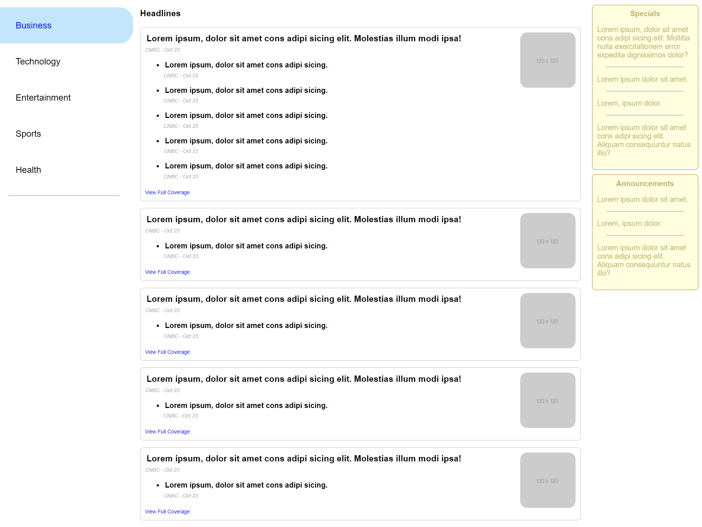
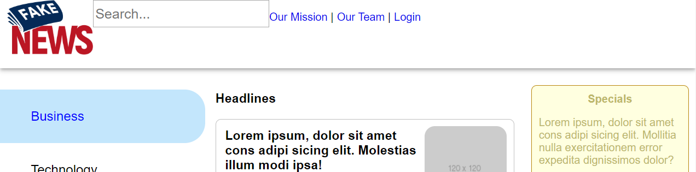
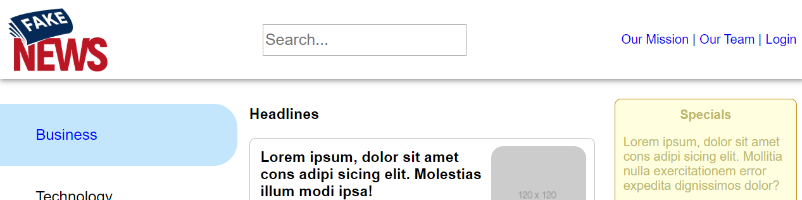

# CSS flexbox tutorial

In this tutorial, you’ll continue working on the same news application from the previous unit, now adding a header and a weather component to it as CSS flexboxes. The existing HTML still uses CSS grid, and you'll add these new components to the grid. CSS grid and flexbox can exist in the same layout and complement each other.

The final product of your changes looks like this:


The new components are also responsive for tablet and phone layouts:

**Header Tablet**:


**Weather Tablet**:


**Header Phone**:


**Weather Phone**:


Notice how the weather component goes from column, to row, and back to column as the viewport width changes.

## Before you begin

Look at the starting HTML code for the application in `index.html`. The HTML is the same as that of the solution from the previous unit, except:

- A `<div>` with the class `container` is now the CSS grid container.
- The CSS grid has declared `grid-template-areas` and `grid-template-rows`.

The style sheet in `styles.css` includes the styles for the general styling of the application. Some style rules for the new components are also included. Today, you'll add the flexbox styling.

Before you begin, run `index.html` using live server. Notice that application looks like the one you created yesterday:



## Step One: Add header to page grid

In this step, you’ll add the `<header>` element to the page and the existing grid.

In `index.html`, add the following HTML after the `<div class="container">` line so that `<header>` is a child element of the `div`:

```HTML
<header id="page-header">
  
  <input type="search" placeholder="Search..." id="search" />
  <nav>
    <ul>
      <li><a href="#">Our Mission</a></li>
      <li><a href="#">Our Team</a></li>
      <li><a href="#">Login</a></li>
    </ul>
  </nav>
</header>
```

If you reload the page now, you might not see the `header`, or another element might overlap it. You have to add CSS so it's displayed in the grid.

In `styles.css`, locate the `#page-header` selector near the top of the file. Add `grid-area: header;` to the CSS rule for the page header:

```CSS
#page-header {
  box-shadow: 0 4px 5px 0 rgba(0,0,0,0.14), 0 1px 10px 0 rgba(0,0,0,0.12), 0 2px 4px -1px rgba(0,0,0,0.2);
  padding-left: 10px;
  padding-right: 10px;
  grid-area: header;
}
```

Next, locate the `div.container` selector a few lines down, and add `"header header header"` as the first line for the `grid-template-areas` declaration:

```CSS
div.container {
  display: grid;
  grid-template-columns: 300px 1fr 250px;
  grid-template-rows: 100px 1fr 1fr;
  gap: 15px;
  grid-template-areas:
    "header header header"
    "left-panel main special-announcements"
    "left-panel main .";
}
```

The header is now in the correct location on the page, but the layout needs work:


You'll adjust the header's layout using flexbox.

## Step Two: Add flexbox to the header

In this step, you'll add flexbox styling to `#page-header`.

Add a declaration to set the `display` property to `flex`:

```CSS
#page-header {
  box-shadow: 0 4px 5px 0 rgba(0,0,0,0.14), 0 1px 10px 0 rgba(0,0,0,0.12), 0 2px 4px -1px rgba(0,0,0,0.2);
  padding-left: 10px;
  padding-right: 10px;
  grid-area: header;
  display: flex;
}
```

The header nearly resembles the final product, but the elements are too close together on the left:



Add another rule to set the `justify-content` property to `space-between`. The `justify-content` property defines the alignment of the flex items along the row or column that the flexbox defines. The `space-between` value evenly distributes the items along that row or column, with the first one at the beginning of the line and the last one at the end of the line.

Your header looks like this:


You've aligned the elements in the header horizontally. Now you need to align the elements vertically. Add a rule for the `align-items` property and set to `center`. The `align-items` property is like the `justify-content` property, but it works in the perpendicular direction.

Your header now looks like this:



However, if you resize the viewport to a tablet width like 768px, the logo and links are close to the sides and that's not usually touch-friendly.

## Step Three: Add responsiveness to header

In `styles.css`, there are two media queries: one for tablet widths (`max-width: 800px`) and one for phone widths (`max-width: 536px`).

Find the `#page-header` selector in the tablet media query. Add `justify-content` and set it to `space-evenly`. The `space-evenly` value is like the `space-between` value you set earlier, but it adds spacing before the first and after the last items.

The tablet layout looks better, but the nav wraps onto two lines on phone layouts. The nav must be on its own line.

Find the `#page-header` selector in the phone media query. Add `flex-wrap` and set it to `wrap`. By default, flex items try to fit onto one line, but you can allow them to wrap onto another line with `flex-wrap: wrap;`.

Your header now looks like the screenshots shown earlier at all sizes.

## Step Four: Add weather component to page grid

In this step, you’ll add the weather component to the page and the existing grid.

Add the following HTML to `index.html` near the end between the closing `</aside>` and the closing `</div>` lines:

```HTML
<aside id="weather">
  <article>
    <header>Weather</header>
    <section>
      <p>
        <span class="day">Today:</span>
        <span class="forecast">Sunny ☀️</span>
        <span class="temperature">High: 67 | Low: 56</span>
      </p>
      <p>
        <span class="day">Tomorrow:</span>
        <span class="forecast">Cloudy ⛅</span>
        <span class="temperature">High: 54 | Low: 49</span>
      </p>
      <p>
        <span class="day">Saturday:</span>
        <span class="forecast">Sunny ☀️</span>
        <span class="temperature">High: 78 | Low: 62</span>
      </p>
      <p>
        <span class="day">Sunday:</span>
        <span class="forecast">Sunny ☀️</span>
        <span class="temperature">High: 73 | Low: 58</span>
      </p>
      <p>
        <span class="day">Monday:</span>
        <span class="forecast">Thunderstorms ⛈️</span>
        <span class="temperature">High: 56 | Low: 49</span>
      </p>
    </section>
  </article>
</aside>
```

If you reload the page now, you might not see the weather component where you'd expect it to be. Like the `<header>` in step one, you have to add CSS so it's displayed in the grid.

In `styles.css`, locate the `div.container` selector again. Before it, add a selector for `aside#weather` and assign a `grid-area` name:

```CSS
aside#weather {
  grid-area: weather;
}
```

In the `div.container` rules, replace the `.` in the `grid-template-areas` with the name assigned to the weather component:

```CSS
div.container {
  display: grid;
  grid-template-columns: 300px 1fr 250px;
  grid-template-rows: 100px 1fr 1fr;
  gap: 15px;
  grid-template-areas:
    "header header header"
    "left-panel main special-announcements"
    "left-panel main weather";
}
```

The weather component is now displayed where and how you'd expect on the desktop layout. However, if you change the viewport to a tablet width, like 768px, you'll see it's still displayed in a column and not a row like it should be.

## Step Five: Add flexbox styling and responsiveness to weather component

In this step, you'll add flexbox styling to the weather component and make it responsive.

Since the weather component displays correctly on the desktop layout, you only need to add the flexbox styling in the media queries.

In the tablet layout, add a selector for `aside#weather section`. Set the `display` property to `flex`. Since the default value of `justify-content` sets all flex items aligned to the left, you'll want to set this property too. Play around with the different `space-*` values and see which one looks best to you:

```CSS
aside#weather section {
  display: flex;
  justify-content: space-around;
}
```

> Note: If you look at the HTML that you added for the weather, the `<section>` element contains the `<p>` elements that make up each day's forecast. When you set an element to `flex`, it only makes the direct children flex items. In this case, the flex items are the `<p>` elements, and that's why you have to set the selector to the `section` in `aside#weather`. Otherwise, `<article>` becomes the flex item.

Finally, if you shrink the viewport down to phone layout, you'll notice the row layout for the weather stops being useful. You can change the direction you want flexboxes to go. By default, they're displayed as a row, but you can change it to a column.

In the tablet layout, add a selector for `aside#weather section`. Set the `flex-direction` property to `column`.

```CSS
aside#weather section {
  flex-direction: column;
}
```

## Summary

In this tutorial, you learned how to add CSS flexboxes to an existing application, how to change a box's direction and spacing, and how to incorporate them with CSS grids. The result represents a more fluid layout that works across many screen widths.
