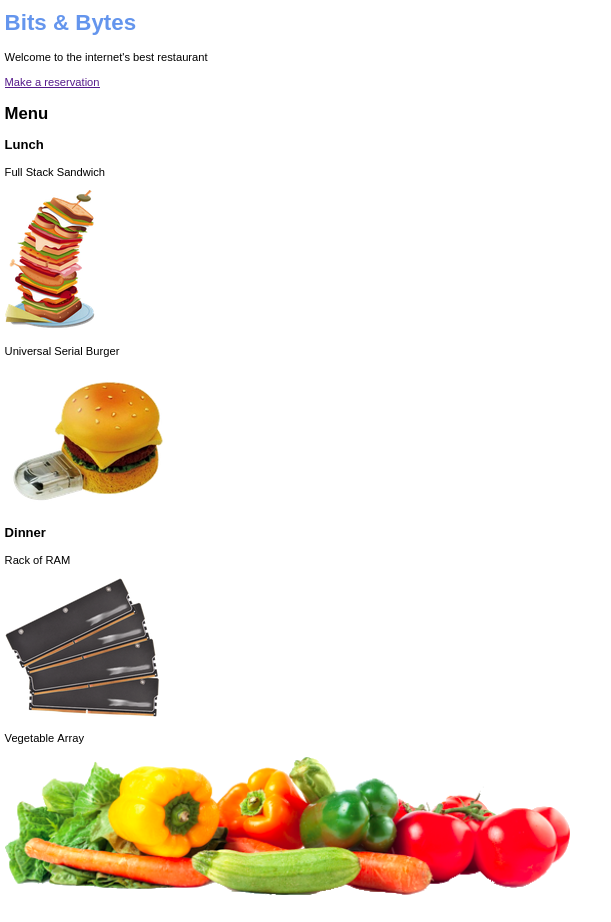
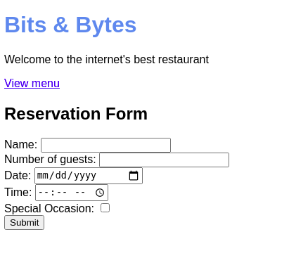

# Intro to HTML and CSS

## Overview of session

In this lecture, you'll build a website for a restaurant. The website contains two pages: the main home page which contains the restaurant menu, and a page with a form to submit a reservation.

## Expected results

### Hints

Take advantage of code generation in IntelliJ or Visual Studio Code.

Remember to use semantic HTML

Use this endpoint in the form's action attribute: https://example.com/api/reservation

The main page should link to the reservations page, and vice versa.

### Main page

### Reservations page

## Session objectives

- Understand the basics of HTML
  - HTML document structure
  - HTML tags & attributes
- Understand the following basic HTML tags:
  - Headings (h1, h2, etc)
  - Paragraphs
  - Links
  - Images
- Utilize the different elements that go into building a form
- Understand the action attribute of the form tag
- Describe what Semantic HTML is
- Demonstrate a basic understanding of what CSS is and how to create style declarations
- Understand how fonts work in the browser and some of the different properties available for styling them
- Understand how colors work and some of the different properties for working with them

## References

- [MDN - Anatomy of an HTML Document](https://developer.mozilla.org/en-US/docs/Learn/HTML/Introduction_to_HTML/Getting_started#Anatomy_of_an_HTML_document)
- [MDN - How to describe a color](https://developer.mozilla.org/en-US/docs/Web/HTML/Applying_color#How_to_describe_a_color)
- [MDN - Semantics in HTML](https://developer.mozilla.org/en-US/docs/Glossary/semantics#Semantics_in_HTML)
