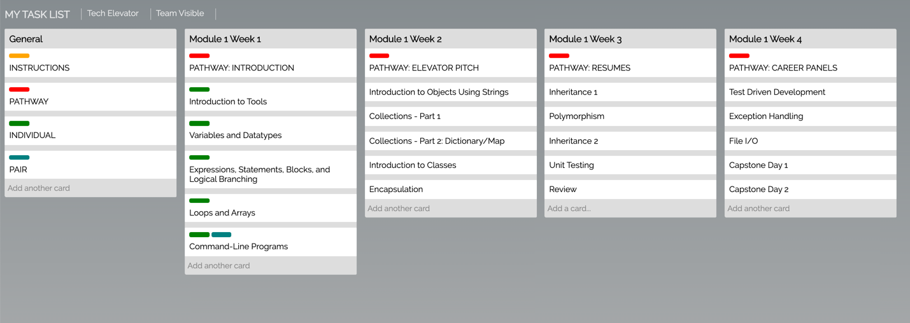

# 02_CSS_Selectors

# CSS Selector and Box Model

## Overview of session

In this lecture, you'll build a Trello clone. The student's lecture code contains the markup needed and an empty style sheet. You'll create the necessary styles to build a page that looks like this:

## Session objectives

- Utilize the following selectors to apply CSS styles:
  - element
  - id
  - class
  - universal
  - attribute
  - pseudo (hover, focus)
  - descendant combinator
- Understand and utilize selector specificity and cascading to apply styles
- Describe the box model (padding, margin, border)
- Demonstrate an understanding of `block`, `inline` and `inline-block`
- Understand the effect of "normal flow" on the positioning of elements on a page
- Describe and use the different positioning styles: `static`, `fixed`, `absolute`, and `relative`
- Understand the difference between common units of measure (px, %, rem) and be able to choose an appropriate unit for CSS styles

